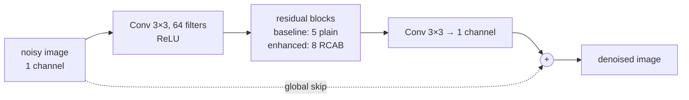

# Image Denoising with ResNet

Grayscale image denoising on the [LFW (Labelled Faces in the Wild)](https://www.tensorflow.org/datasets/catalog/lfw) dataset using residual convolutional networks in TensorFlow/Keras. Two notebooks are provided: a baseline and an enhanced version with channel attention, blind denoising, and an SSIM + L1 loss.

[](https://colab.research.google.com/github/AdebanjiAdelowo/Image_denoising_using_ResNet/blob/main/final_image_denoising.ipynb)
&nbsp;
[](https://colab.research.google.com/github/AdebanjiAdelowo/Image_denoising_using_ResNet/blob/main/resnet_enhanced_denoiser.ipynb)

---

## Notebooks

### `final_image_denoising.ipynb`: Baseline ResNet
Straightforward residual network trained end-to-end on full 250×250 images with fixed Gaussian noise (σ = 0.09).

### `resnet_enhanced_denoiser.ipynb`: Enhanced ResNet with Channel Attention
Architectural and training changes (patch-based training, channel attention, blind denoising, SSIM+L1 loss) aimed at improving PSNR/SSIM over the baseline.

---

## Architecture Comparison

| Feature | Baseline | Enhanced |
|---|---|---|
| Residual blocks | 5 plain res blocks | 8 RCAB blocks |
| Channel attention | ✗ | ✓ Squeeze-and-Excitation |
| Training data | 3 000 full images (10 % held out for validation) | 64 000 random 64×64 patches (80 000 extracted, 80/20 train/validation split) |
| Augmentation | None | Random horizontal + vertical flip |
| Noise during training | Fixed σ = 0.09 | Random σ ∈ [0.05, 0.15] (blind) |
| Loss function | MSE | 0.8 × (1−SSIM) + 0.2 × L1 |
| LR schedule | Fixed 1e-3 | Cosine decay 1e-3 → 1e-6 |
| Batch size | 32 | 64 |

Both networks share the same skeleton (`build_model` in the baseline notebook,
`build_enhanced_model` in the enhanced one). They differ only in the block type and count, and both
add the input back at the end, so the stacked blocks learn a correction to the noisy image:



### Residual Channel Attention Block (RCAB)

```
x ──► Conv(3×3)─BN─ReLU─Conv(3×3)─BN ──► Squeeze-and-Excitation ──► Add(x) ──► ReLU
                                                      │
                                          GlobalAvgPool → FC(C/8)→ReLU→FC(C)→Sigmoid
                                          (channel-wise attention weights)
```

The **Squeeze-and-Excitation** sub-block learns to re-weight each feature channel by its global importance, allowing the network to focus on the most informative features for denoising.

---

## Key Design Decisions

**Patch-based training.** Extracting 16 random 64×64 patches from each of 5 000 images gives 80 000 patches (64 000 for training, 16 000 for validation) versus 3 000 full images, at a fraction of the memory cost. The model is fully convolutional and infers on any image size at test time.

**Blind denoising (random σ).** Training with σ drawn uniformly from [0.05, 0.15] instead of a fixed value makes the model robust across noise levels without retraining.

**Combined SSIM + L1 loss.** MSE optimises pixel-level fidelity but can produce blurry results. SSIM captures luminance, contrast, and structural similarity, giving sharper, more visually pleasing outputs.

**Cosine LR decay.** The learning rate follows a cosine curve from 1e-3 to 1e-6, providing large steps early in training and fine-grained updates near convergence.

---

## Results

Measured on 1 000 test images (Gaussian noise, σ = 0.09), as reported by the model comparison cell in `resnet_enhanced_denoiser.ipynb`. The test images are the last 1 000 of the 5 000 images sampled in that notebook (all drawn from the TFDS `lfw` train split):

| Model | PSNR (dB) | SSIM |
|---|---|---|
| Noisy input | 21.42 | 0.344 |
| Baseline ResNet (5 blocks, MSE) | 28.32 | 0.724 |
| Enhanced ResNet (8 RCAB, SSIM+L1) | 33.71 | 0.918 |

Exact numbers depend on random seed and early stopping epoch; run the notebooks to reproduce.

Two caveats on this comparison, both visible in the notebook code:

- In `resnet_enhanced_denoiser.ipynb` the 16 000 validation patches are cropped from images 4 000 to
  4 999, which are also the 1 000 test images. They are not used for gradient updates, but early
  stopping (35 of 60 epochs, best weights restored) is driven by their validation loss, so model
  selection has seen crops of the test images.
- The dataset sampling (`shuffle(7000).take(5000)`) is not seeded, so the two notebooks draw
  independent random subsets. The baseline is trained in `final_image_denoising.ipynb` and then
  scored on the enhanced notebook's test images, some of which may be among its own training
  images.

In the saved output of the qualitative-comparison cell in `resnet_enhanced_denoiser.ipynb`, the
enhanced model removes the residual grain left by the baseline but also visibly smooths fine texture
such as skin and hair, a loss of detail that the aggregate PSNR/SSIM gains do not reflect.

The enhanced model was also evaluated zero-shot on salt-and-pepper noise (frequency 0.05) despite being trained only on Gaussian noise. PSNR improved from 17.75 dB to 22.56 dB and SSIM from 0.370 to 0.543, a smaller gain than for the in-distribution Gaussian case, indicating limited but nonzero robustness to an unseen noise type.

---

## Setup

**Requirements** (installed automatically on Colab with GPU runtime):

```
tensorflow >= 2.10
tensorflow-datasets
numpy
scikit-image
matplotlib
```

**Local install:**

```bash
pip install tensorflow tensorflow-datasets scikit-image matplotlib
```

---

## How to Run

### Colab (recommended: free GPU)

1. Click the **Open in Colab** badge above for the notebook you want.
2. **Runtime → Change runtime type → T4 GPU**.
3. Run all cells (`Runtime → Run all`).

### Local

```bash
git clone https://github.com/AdebanjiAdelowo/Image_denoising_using_ResNet
cd Image_denoising_using_ResNet
pip install tensorflow tensorflow-datasets scikit-image matplotlib
jupyter notebook
```

Open either notebook and run all cells. GPU is strongly recommended; CPU training on 80 000 patches will be slow.

---

## Repository Layout

```
Image_denoising_using_ResNet/
├── final_image_denoising.ipynb        # Baseline ResNet (5 blocks, MSE loss)
├── resnet_enhanced_denoiser.ipynb     # Enhanced ResNet (8 RCAB, SSIM+L1 loss)
└── README.md
```

Saved models (`best_denoiser.keras`, `enhanced_denoiser_resnet.keras`) and output figures are written to the Colab working directory during training and are not committed to the repository.

---

## References

- He et al. (2016), *Deep Residual Learning for Image Recognition*, CVPR
- Zhang et al. (2017), *Beyond a Gaussian Denoiser: Residual Learning of Deep CNN for Image Denoising*, TIP
- Hu et al. (2018), *Squeeze-and-Excitation Networks*, CVPR
- Zhang et al. (2018), *Image Super-Resolution Using Very Deep Residual Channel Attention Networks (RCAN)*, ECCV
- LFW Dataset: [tensorflow.org/datasets/catalog/lfw](https://www.tensorflow.org/datasets/catalog/lfw)

---

## License

MIT
